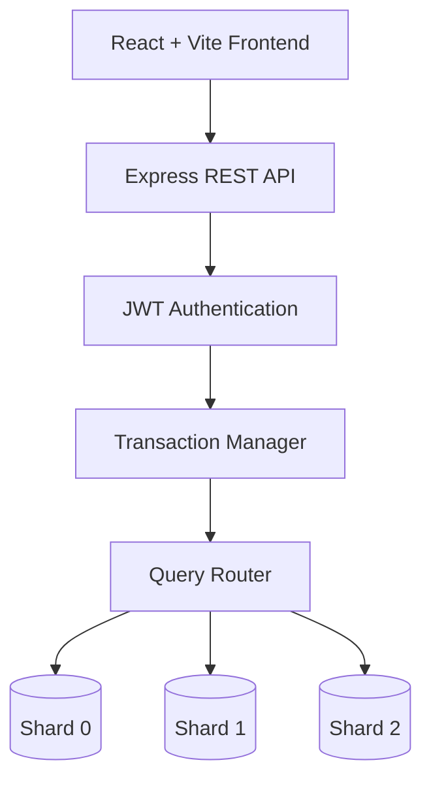

#  Distributed Attendance Management System

<p align="center">


</p>

<p align="center">

A semester-long database engineering project developed as part of <b>CS 432 – Database Systems</b> at <b>IIT Gandhinagar</b> under the guidance of <b>Prof. Yogesh Kumar Meena</b>.

</p>

---

## Overview

This project explores the design and implementation of modern database systems using an **Attendance Management System** as the application domain.

Unlike a traditional CRUD application, the project progressively evolves into a **distributed database system**, incorporating concepts typically found inside production-grade database engines. Over four development phases, the system was extended with custom indexing, transaction processing, crash recovery, horizontal sharding, distributed query routing, and performance evaluation.

The objective was not simply to build an attendance portal, but to understand **how database systems work internally**, how they scale, and how they maintain consistency under concurrent workloads.

---

##  Key Highlights

- Full-stack Attendance Management System
- JWT Authentication & Role-Based Access Control
- Custom REST API Architecture
- Relational Database Design & Normalization
- Custom B+ Tree Index (implemented from scratch)
- ACID-Compliant Transaction Manager
- Write-Ahead Logging (WAL)
- Rollback & Crash Recovery
- Horizontal Database Sharding
- Student-ID Based Hash Partitioning
- Distributed Query Routing
- Performance Benchmarking
- Stress Testing using **Locust** (1000 Concurrent Users)

---

#  System Architecture



---

## System Screenshots

> Replace the placeholders below with actual screenshots.

| Module | Preview |
|----------|---------|
| Login Page | `images/login.png` |
| Dashboard | `images/dashboard.png` |
| Attendance Portal | `images/attendance.png` |
| Admin Panel | `images/admin.png` |
| Student Portal | `images/student.png` |
| Analytics | `images/analytics.png` |

---

#  Technology Stack

## Frontend

- React
- Vite
- JavaScript
- Tailwind CSS

## Backend

- Node.js
- Express.js

## Database

- MySQL

## Authentication

- JWT Authentication
- Role-Based Access Control (RBAC)

## Database Engineering

- B+ Tree Index (Python)
- ACID Transactions
- Write Ahead Logging
- Crash Recovery
- Horizontal Database Sharding
- Query Routing

## Testing & Evaluation

- Locust
- Graphviz
- Postman

# 📚 Project Evolution

The project was developed over **four incremental phases** as part of the semester-long **CS 432 – Database Systems** course. Each phase introduced new database concepts while extending the capabilities of the previous implementation.

Instead of building an attendance management application from scratch every time, the system evolved into a progressively more sophisticated database platform, closely resembling the architecture of modern DBMSs.

---

# Phase I — Relational Database Design

### 🎯 Objective

The primary objective of the first phase was to design a robust relational database capable of handling the workflows of an attendance management platform while maintaining data consistency and eliminating redundancy.

---

### 📌 Problem Statement

Educational institutions maintain large volumes of structured information involving students, faculty, courses, classrooms and attendance records. A poorly designed schema often leads to redundancy, update anomalies and inconsistent data.

The first phase focused on designing a normalized relational database that could efficiently model these relationships.

---

### ⚙️ Implementation

The following database engineering concepts were implemented:

- Requirement Analysis
- Entity Relationship (ER) Modelling
- Relational Schema Design
- Database Normalization (up to appropriate normal forms)
- Primary Keys
- Foreign Keys
- Referential Integrity
- Constraints
- SQL Schema Creation

The resulting schema models multiple entities including:

- Students
- Faculty
- Courses
- Attendance Records
- Departments
- Classrooms
- Administrative Users

Relationships between these entities were carefully designed to minimize redundancy while preserving data integrity.

---

### 📸 Placeholder

> Insert ER Diagram here.

```
images/er_diagram.png
```

---

> Insert Relational Schema here.

```
images/schema.png
```

---

# Phase II — Database Optimization & Indexing

###  Objective

Once the relational database was functional, the second phase focused on improving performance and usability by building a complete web application backed by optimized database operations.

---

###  Full Stack Application

The attendance platform was extended into a complete client-server architecture consisting of:

- React + Vite Frontend
- Express.js Backend
- MySQL Database
- JWT Authentication
- Role Based Access Control

REST APIs were developed to perform attendance management operations while ensuring secure communication between the frontend and backend.

---

###  Authentication & Authorization

The application implements JWT based authentication with Role Based Access Control (RBAC).

Supported roles include:

- Student
- Faculty
- Administrator

Different user roles have different permissions for accessing attendance records, course information and administrative operations.

---

###  Custom B+ Tree Index

One of the major objectives of this phase was understanding how database indexing works internally.

Instead of relying solely on MySQL indexes, a **custom B+ Tree** was implemented **from scratch in Python**.

Supported operations include:

- Insert
- Delete
- Search
- Update
- Range Queries
- Node Splitting
- Node Merging

The implementation demonstrates how balanced indexing structures reduce search complexity and improve database performance for large datasets.

---

###  Performance Evaluation

The custom B+ Tree implementation was benchmarked against traditional search methods to compare:

- Search Performance
- Insertion Performance
- Range Query Efficiency
- Scalability

---

###  Placeholder

> B+ Tree Visualization

```
images/bplustree.png
```

---

> Performance Comparison

```
images/bplustree_benchmark.png
```

---

# Phase III — Transaction Processing & Recovery

###  Objective

The third phase focused on one of the most critical aspects of database systems—maintaining consistency in the presence of failures and concurrent transactions.

Real-world databases must guarantee that data remains correct even if the application crashes during execution.

---

###  Transaction Manager

A transaction management layer was introduced to enforce the ACID properties:

- Atomicity
- Consistency
- Isolation
- Durability

Each transaction is executed as a single logical unit.

If an operation fails midway, all previous operations belonging to that transaction are rolled back automatically.

---

###  Write Ahead Logging (WAL)

Before applying any modification to the database, changes are first recorded in a Write Ahead Log.

This enables the system to recover successfully after unexpected crashes while maintaining consistency.

---

###  Crash Recovery

Crash recovery mechanisms were implemented to restore the database to a consistent state after failures.

Recovery includes:

- Transaction Rollback
- Log Replay
- Consistency Validation

---

###  Concurrent Transactions

The system was evaluated under multiple simultaneous operations to ensure:

- Isolation
- Data Consistency
- Correct Transaction Ordering

---

###  Placeholder

```
images/transaction_flow.png
```

---

```
images/wal.png
```

---

# Phase IV — Distributed Database & Horizontal Sharding

###  Objective

As the volume of attendance data increases, storing all records inside a single database becomes inefficient.

The final phase focused on improving scalability by transforming the system into a distributed database.

---

###  Horizontal Sharding

The database was partitioned across multiple shards.

Student records are assigned to shards using **Student-ID based hashing**, allowing data to be distributed evenly.

```
Student ID
      │
Hash Function
      │
 ┌────┼────┐
 │    │    │
S0   S1   S2
```

This strategy reduces storage bottlenecks and improves query scalability.

---

###  Query Routing

Incoming requests are processed by a query router that determines the appropriate shard based on the student's identifier.

The router forwards requests only to the required shard, minimizing unnecessary database operations.

---

###  Distributed Query Processing

Operations spanning multiple shards are coordinated through distributed query execution.

The implementation demonstrates practical challenges associated with:

- Distributed Storage
- Data Partitioning
- Query Routing
- Scalability

---

###  CAP Theorem

The project also explores trade-offs between:

- Consistency
- Availability
- Partition Tolerance

and discusses how distributed systems balance these competing requirements.

---

###  Placeholder

```
images/sharding_architecture.png
```

---

```
images/query_router.png
```

---

##  Learning Outcomes

Through four progressively challenging development phases, this project provided hands-on exposure to concepts typically taught independently in database courses.

The final system combines:

- Full Stack Development
- Relational Database Design
- Authentication & Authorization
- Indexing Structures
- Transaction Management
- Crash Recovery
- Distributed Databases
- Performance Evaluation

into a single cohesive application.
#  Performance Evaluation

Implementing a database system is only one aspect of engineering a reliable application. Equally important is evaluating how the system behaves under increasing workloads, concurrent users, and failure scenarios.

Throughout the project, different components were evaluated using benchmarking techniques, stress testing, and functional validation to ensure correctness, scalability, and performance.

---

#  B+ Tree Performance Analysis

Traditional database systems rely heavily on indexing structures to reduce search latency. To understand this process, a custom **B+ Tree** implementation was developed from scratch and evaluated against conventional search techniques.

The implementation supports:

- Search
- Insert
- Delete
- Update
- Range Queries
- Node Splitting
- Node Merging

The balanced nature of B+ Trees ensures logarithmic search complexity while supporting efficient sequential traversal for range queries.

---

## Performance Metrics

The following metrics were considered during evaluation.

| Metric | Description |
|---------|-------------|
| Search Time | Time required to locate a record |
| Insertion Time | Time required to insert a new record |
| Update Time | Modification latency |
| Range Query Performance | Sequential retrieval efficiency |
| Tree Height | Effect on search complexity |

---

###  Benchmark Results

> **Placeholder**

```
images/bplustree_benchmark.png
```

---

### 📸 B+ Tree Visualization

> **Placeholder**

```
images/bplustree_visualization.png
```

---

#  Transaction Processing Evaluation

Database transactions must guarantee that multiple operations execute safely without leaving the system in an inconsistent state.

The transaction manager was evaluated under different execution scenarios to validate correctness.

---

## ACID Properties

| Property | Implementation |
|----------|----------------|
| Atomicity | Rollback of incomplete transactions |
| Consistency | Constraint validation |
| Isolation | Independent concurrent execution |
| Durability | Write Ahead Logging |

---

## Failure Scenarios Tested

- Interrupted transactions
- Simulated crashes
- Concurrent modifications
- Rollback execution
- Recovery from logs

The recovery mechanism successfully restored the database to a consistent state without data corruption.

---

###  Transaction Flow

> **Placeholder**

```
images/transaction_execution.png
```

---

###  WAL Recovery
> **Placeholder**

```
images/wal_recovery.png
```

---

#  Distributed Database Evaluation

The final implementation distributes records across multiple database shards using **Student-ID based hash partitioning**.

Instead of storing all records inside a single database instance, incoming requests are routed dynamically to the appropriate shard.

---

## Sharding Strategy

```
Student ID

↓

Hash Function

↓

Shard Selection

↓

Execute Query
```

---

## Advantages

- Reduced storage bottlenecks
- Better horizontal scalability
- Faster query execution
- Lower load per database instance
- Improved parallelism

---

## Distributed Queries

Certain operations require accessing multiple shards simultaneously.

Examples include:

- Global attendance statistics
- Overall student analytics
- Multi-shard administrative queries

The query router coordinates these requests while abstracting shard locations from the frontend.

---

###  Sharding Architecture

> **Placeholder**

```
images/sharding_architecture.png
```

---

###  Query Routing

> **Placeholder**

```
images/query_router.png
```

---

#  Stress Testing

After implementing the distributed architecture, the application was subjected to stress testing using **Locust**.

Locust enabled the simulation of concurrent users interacting with the application through realistic HTTP requests.

The objective was to evaluate:

- System scalability
- Request throughput
- Average response time
- Failure rate
- Resource utilization

---

## Test Configuration

| Parameter | Value |
|-----------|-------|
| Tool | Locust |
| Concurrent Users | **1000** |
| Protocol | HTTP |
| Target | REST API |

---

## Metrics Collected

- Average Response Time
- Median Response Time
- 95th Percentile Latency
- Requests per Second
- Concurrent Users
- Success Rate
- Failure Rate

---

###  Locust Dashboard

> **Placeholder**

```
images/locust_dashboard.png
```

---

###  Throughput

> **Placeholder**

```
images/throughput.png
```

---

###  Response Time

> **Placeholder**

```
images/response_time.png
```

---

###  Concurrent Users

> **Placeholder**

```
images/concurrent_users.png
```

---

#  Database Concepts Demonstrated

The project combines several concepts that are typically taught independently in a database systems curriculum.

## Relational Databases

- Database Normalization
- ER Modelling
- Schema Design
- Referential Integrity
- SQL Constraints

---

## Backend Engineering

- REST APIs
- JWT Authentication
- RBAC
- CRUD Operations
- Express Middleware

---

## Database Internals

- B+ Tree Indexing
- Query Optimization
- Transaction Processing
- Write Ahead Logging
- Crash Recovery

---

## Distributed Systems

- Horizontal Sharding
- Query Routing
- Hash Partitioning
- CAP Theorem
- Scalability

---

## Software Engineering

- Full Stack Development
- Modular Backend Architecture
- Performance Evaluation
- Stress Testing
- Benchmarking

---
#  Demonstration
The repository also contains demonstration videos showcasing different aspects of the system.

| Demo | Description |
|------|-------------|
| Full Demo | End-to-end walkthrough |
| Authentication | JWT login & authorization |
| Attendance Workflow | Student & faculty operations |
| Transaction Processing | Rollback & recovery |
| Distributed Sharding | Query routing between shards |

---

##  Demo Placeholders

```
demo/full_demo.mp4
```

```
demo/sharding_demo.mp4
```

```
demo/transaction_demo.mp4
```

```
demo/auth_demo.mp4
```
