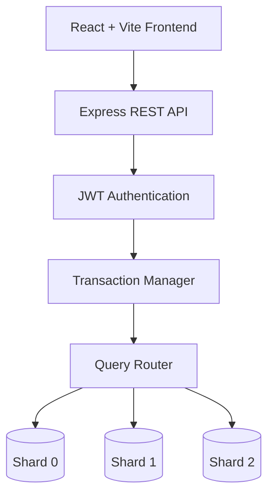

#  Distributed Attendance Management System

<p align="center">


</p>

<p align="center">

A semester-long database engineering project developed as part of <b>CS 432 – Database Systems</b> at <b>IIT Gandhinagar</b> under the guidance of <b>Prof. Yogesh Kumar Meena</b>.

</p>

---

## Overview

This project explores the design and implementation of modern database systems using an **Attendance Management System** as the application domain.

Unlike a traditional CRUD application, the project progressively evolves into a **distributed database system**, incorporating concepts typically found inside production-grade database engines. Over four development phases, the system was extended with custom indexing, transaction processing, crash recovery, horizontal sharding, distributed query routing, and performance evaluation.

The objective was not simply to build an attendance portal, but to understand **how database systems work internally**, how they scale, and how they maintain consistency under concurrent workloads.

---

##  Key Highlights

- Full-stack Attendance Management System
- JWT Authentication & Role-Based Access Control
- Custom REST API Architecture
- Relational Database Design & Normalization
- Custom B+ Tree Index (implemented from scratch)
- ACID-Compliant Transaction Manager
- Write-Ahead Logging (WAL)
- Rollback & Crash Recovery
- Horizontal Database Sharding
- Student-ID Based Hash Partitioning
- Distributed Query Routing
- Performance Benchmarking
- Stress Testing using **Locust** (1000 Concurrent Users)

---

#  System Architecture



---


#  Technology Stack

## Frontend

- React
- Vite
- JavaScript
- Tailwind CSS

## Backend

- Node.js
- Express.js

## Database

- MySQL

## Authentication

- JWT Authentication
- Role-Based Access Control (RBAC)

## Database Engineering

- B+ Tree Index (Python)
- ACID Transactions
- Write Ahead Logging
- Crash Recovery
- Horizontal Database Sharding
- Query Routing

## Testing & Evaluation

- Locust
- Graphviz
- Postman

#  Project Evolution

The project was developed over **four incremental phases**. Each phase introduced new database concepts while extending the capabilities of the previous implementation.


---

# Phase I — Relational Database Design

###  Objective

The primary objective of the first phase was to design a robust relational database capable of handling the workflows of an attendance management platform while maintaining data consistency and eliminating redundancy.

---
###  Implementation

The following database engineering concepts were implemented:

- Requirement Analysis
- Entity Relationship (ER) Modelling
- Relational Schema Design
- Database Normalization (up to appropriate normal forms)
- Primary Keys
- Foreign Keys
- Referential Integrity
- Constraints
- SQL Schema Creation

The resulting schema models multiple entities including:

- Students
- Faculty
- Courses
- Attendance Records
- Departments
- Classrooms
- Administrative Users

Relationships between these entities were carefully designed to minimize redundancy while preserving data integrity.

---

###  Placeholder

> Insert ER Diagram here.

```
images/er_diagram.png
```

---

> Insert Relational Schema here.

```
images/schema.png
```

---

# Phase II — Database Optimization & Indexing

###  Objective

Once the relational database was functional, the second phase focused on improving performance and usability by building a complete web application backed by optimized database operations.

---

###  Full Stack Application

The attendance platform was extended into a complete client-server architecture consisting of:

- React + Vite Frontend
- Express.js Backend
- MySQL Database
- JWT Authentication
- Role Based Access Control

REST APIs were developed to perform attendance management operations while ensuring secure communication between the frontend and backend.

---

###  Authentication & Authorization

The application implements JWT based authentication with Role Based Access Control (RBAC).

Supported roles include:

- Student
- Faculty
- Administrator

Different user roles have different permissions for accessing attendance records, course information and administrative operations.

---

###  Custom B+ Tree Index

One of the major objectives of this phase was understanding how database indexing works internally.

Instead of relying solely on MySQL indexes, a **custom B+ Tree** was implemented **from scratch in Python**.

Supported operations include:

- Insert
- Delete
- Search
- Update
- Range Queries
- Node Splitting
- Node Merging

The implementation demonstrates how balanced indexing structures reduce search complexity and improve database performance for large datasets.

---
# Phase III — Transaction Processing & Recovery

###  Objective

The third phase focused on one of the most critical aspects of database systems—maintaining consistency in the presence of failures and concurrent transactions.

Real-world databases must guarantee that data remains correct even if the application crashes during execution.

---

###  Transaction Manager

A transaction management layer was introduced to enforce the ACID properties:

- Atomicity
- Consistency
- Isolation
- Durability

Each transaction is executed as a single logical unit.

If an operation fails midway, all previous operations belonging to that transaction are rolled back automatically.

---

###  Write Ahead Logging (WAL)

Before applying any modification to the database, changes are first recorded in a Write Ahead Log.

This enables the system to recover successfully after unexpected crashes while maintaining consistency.

---

###  Crash Recovery

Crash recovery mechanisms were implemented to restore the database to a consistent state after failures.

Recovery includes:

- Transaction Rollback
- Log Replay
- Consistency Validation

---

###  Concurrent Transactions

The system was evaluated under multiple simultaneous operations to ensure:

- Isolation
- Data Consistency
- Correct Transaction Ordering

---

# Phase IV — Distributed Database & Horizontal Sharding

###  Objective

As the volume of attendance data increases, storing all records inside a single database becomes inefficient.

The final phase focused on improving scalability by transforming the system into a distributed database.

---

###  Horizontal Sharding

The database was partitioned across multiple shards.

Student records are assigned to shards using **Student-ID based hashing**, allowing data to be distributed evenly.

```
Student ID
      │
Hash Function
      │
 ┌────┼────┐
 │    │    │
S0   S1   S2
```

This strategy reduces storage bottlenecks and improves query scalability.

---

###  Query Routing

Incoming requests are processed by a query router that determines the appropriate shard based on the student's identifier.

The router forwards requests only to the required shard, minimizing unnecessary database operations.

---

###  Distributed Query Processing

Operations spanning multiple shards are coordinated through distributed query execution.

The implementation demonstrates practical challenges associated with:

- Distributed Storage
- Data Partitioning
- Query Routing
- Scalability

---

###  CAP Theorem

The project also explores trade-offs between:

- Consistency
- Availability
- Partition Tolerance

and discusses how distributed systems balance these competing requirements.

---

##  Learning Outcomes

Through four progressively challenging development phases, this project provided hands-on exposure to concepts typically taught independently in database courses.

The final system combines:

- Full Stack Development
- Relational Database Design
- Authentication & Authorization
- Indexing Structures
- Transaction Management
- Crash Recovery
- Distributed Databases
- Performance Evaluation

into a single cohesive application.
#  Performance Evaluation

Implementing a database system is only one aspect of engineering a reliable application. Equally important is evaluating how the system behaves under increasing workloads, concurrent users, and failure scenarios.

Throughout the project, different components were evaluated using benchmarking techniques, stress testing, and functional validation to ensure correctness, scalability, and performance.

---

## Failure Scenarios Tested

- Interrupted transactions
- Simulated crashes
- Concurrent modifications
- Rollback execution
- Recovery from logs

The recovery mechanism successfully restored the database to a consistent state without data corruption.

---


#  Stress Testing

After implementing the distributed architecture, the application was subjected to stress testing using **Locust**.

Locust enabled the simulation of concurrent users interacting with the application through realistic HTTP requests.

The objective was to evaluate:

- System scalability
- Request throughput
- Average response time
- Failure rate
- Resource utilization

---


#  Repository Structure

The repository is organized into modular components to separate frontend, backend, documentation and evaluation artifacts.

```text
distributed-attendance-management-system
│
├── backend/                # Express.js Backend
│   ├── controllers/
│   ├── middleware/
│   ├── routes/
│   ├── utils/
│   ├── config/
│   └── server.js
│
├── frontend/               # React + Vite Frontend
│   ├── src/
│   ├── components/
│   ├── pages/
│   ├── assets/
│   └── App.jsx
│
├── reports/
│   ├── Phase_1_Report.pdf
│   ├── Phase_2_Report.pdf
│   ├── Phase_3_Report.pdf
│   └── Phase_4_Report.pdf
│
├── images/
│
├── demo/
│
├── docs/
│
└── README.md
```

---

#  Project Documentation

The project was developed incrementally over four milestones.

Each milestone introduces progressively advanced database engineering concepts while extending the previous implementation.

| Phase | Topics Covered |
|--------|----------------|
| Phase I | Relational Database Design, ER Modelling, Normalization |
| Phase II | REST APIs, JWT Authentication, RBAC, Query Optimization, B+ Trees |
| Phase III | ACID Transactions, WAL, Rollback, Crash Recovery |
| Phase IV | Horizontal Sharding, Query Routing, Distributed Databases |

Complete reports are available inside the **reports/** directory.

---

#  Getting Started

## Clone Repository

```bash
git clone https://github.com/<username>/distributed-attendance-management-system.git

cd distributed-attendance-management-system
```

---

## Backend Setup

```bash
cd backend

npm install

npm run dev
```

Backend server starts on

```
http://localhost:3000
```

---

## Frontend Setup

```bash
cd frontend

npm install

npm run dev
```

Frontend runs on

```
http://localhost:5173
```

---

## Database Setup

Configure MySQL before running the application.

Create the required databases and import the schema provided in the documentation.

For the distributed version, configure multiple database shards according to the project documentation.

Example:

```
Shard 0

Shard 1

Shard 2
```

Update database credentials inside

```
backend/config
```

before starting the server.

---

#  Environment Variables

Example

```
PORT=

JWT_SECRET=

DB_HOST=

DB_USER=

DB_PASSWORD=

DB_NAME=
```

---


#  Demonstration Videos
You can find the demonstration videos with proper explanation in the reports.
---

#  Future Improvements

Although the current implementation demonstrates the core concepts of modern database systems, several extensions can further improve the platform.

Possible future work includes

- Two Phase Commit (2PC)
- Replication & Fault Tolerance
- Distributed Transaction Manager
- Automatic Load Balancing
- Query Cost Optimizer
- Caching Layer using Redis
- Docker-based Deployment
- Kubernetes Orchestration
- Monitoring using Prometheus & Grafana
- Cloud Deployment (AWS/GCP/Azure)

---


#  Contributors

This project was developed as a semester-long course project for **CS 432 – Database Systems** at the **Indian Institute of Technology Gandhinagar** under the guidance of **Prof. Yogesh Kumar Meena**.

### Team Members

- Aryan Meshram
- Saksham Chourasia
- Pallav Biyala 
- Jahan Zaib
- Mateen Sharief

---

##  My Contributions

As part of the project, I contributed to several aspects of the system, including:

- Developed significant portions of the frontend using **React**, **Vite**, and **Tailwind CSS**.
- Built and integrated backend APIs using **Node.js** and **Express.js**.
- Implemented **JWT-based authentication** and role-based access control (RBAC).
- Designed and integrated attendance management workflows across the frontend and backend.
- Participated in implementing advanced database concepts introduced throughout the project, including indexing, transaction management, and distributed database features.
- Assisted with system integration, testing, debugging, documentation, and final project demonstrations.

---
#  License

This repository is intended for academic and educational purposes.

---

# Acknowledgements

We would like to thank **Prof. Yogesh Kumar Meena** for designing the project milestones that progressively introduced real-world database engineering concepts throughout the semester.

The project successfully integrates concepts from

- Database Systems
- Distributed Databases
- Backend Development
- Software Engineering
- Performance Evaluation

into a single end-to-end full stack application.
